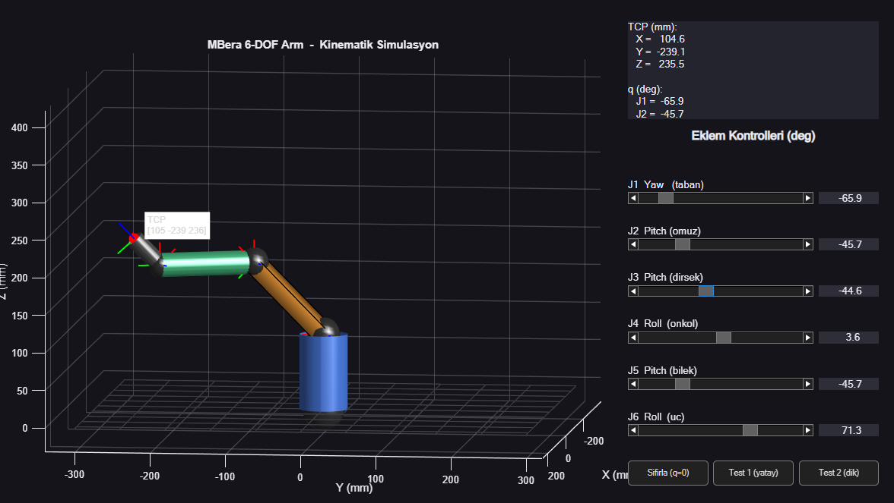

# MBera 6-DOF Robot Kol

Sıfırdan tasarladığım 6 eksenli (6-DOF) robotik kol projesi: kinematik–dinamik teorisi, MATLAB simülasyonu ve ileride 3D baskı + servo kontrol fazları.

Bu repo, projenin **yazılım/teori** tarafını içerir. Donanım fazı (CAD, 3D baskı, Arduino + PCA9685 + MG996R/SG90) ilerleyen sürümlerde eklenecek.



---

## 🎯 Amaç

- Robot kinematiği & dinamiği teorisini uygulamalı öğrenmek
- DH parametreleri, ileri/ters kinematik, Jakobiyen, statik tork hesabı
- MATLAB'da gerçek mm ölçülerinde interaktif simülasyon
- İlerleyen fazda fiziksel kolu kurup pick & place demosu

---

## 📂 Repo İçeriği

| Dosya | Açıklama |
|---|---|
| [`01_kinematik_dinamik.md`](01_kinematik_dinamik.md) | FAZ 1 — DH konvansiyonu, dönüşüm matrisleri, FK/IK, Jakobiyen, dinamik teorisi |
| [`02_model_DH_dinamik.md`](02_model_DH_dinamik.md) | Modelin gerçek STL/STP ölçülerinden çıkarılan **kesin DH parametreleri**, çalışma uzayı ve servo tork doğrulaması |
| [`03_matlab_simulasyon_egitim.md`](03_matlab_simulasyon_egitim.md) | MATLAB simülasyonunun adım adım açıklaması |
| [`matlab_simulasyon.m`](matlab_simulasyon.m) | Kendi başına çalışan MATLAB simülasyonu (Peter Corke RTB **gerekmez**) |
| `sim_photo.png` | Simülasyondan ekran görüntüsü |
| `proje dosyalari/measure_parts.py` | STL bbox ölçümü için yardımcı script |
| `proje dosyalari/parse_assembly.py` | STP assembly analizi için yardımcı script |

---

## 📐 Robot Geometrisi

Standard DH (mm cinsinden):

| Link | θ | d | a | α |
|:---:|:---:|---:|---:|:---:|
| 1 | q₁ | 100 | 0 | −π/2 |
| 2 | q₂ | 0 | 138 | 0 |
| 3 | q₃ | 0 | 0 | −π/2 |
| 4 | q₄ | 130 | 0 | +π/2 |
| 5 | q₅ | 0 | 0 | −π/2 |
| 6 | q₆ | 50 | 0 | 0 |

**Konfigürasyon:** Antropomorfik (insan koluna benzer) + küresel bilek → ters kinematik kapalı-form çözülür.

**Doğrulama testleri:**
- `q = 0` → TCP = `[268, 0, 50]` mm ✅
- `q₂ = −π/2` (omuz dik) → TCP = `[0, 0, 318]` mm ✅

---

## 🖥️ Simülasyonu Çalıştırma

MATLAB R2016b+ yeterli, ek toolbox gerekmiyor:

```matlab
>> robot_arm_sim
```

**Özellikler:**
- 6 slider ile her eklemi bağımsız kontrol
- Gerçek mm ölçülerinde 3B görsel
- Anlık TCP (uç nokta) koordinatı
- Hazır pozlar: `Sıfırla (q=0)`, `Test 1 (yatay)`, `Test 2 (dik)`
- Karanlık tema arayüz

---

## ⚙️ Donanım Hedefleri

| Eklem | Servo | Tork |
|---|---|---|
| J1, J2, J3, J4 | MG996R | ~10 kg·cm |
| J5, J6 | SG90 | ~1.8 kg·cm |

Statik tork analizine göre **20 g payload**'a kadar güvenli. Kontrolcü: Arduino Uno + PCA9685 16-kanal PWM sürücü.

---

## 🗺️ Yol Haritası

- [x] FAZ 1 — Kinematik/dinamik teori
- [x] FAZ 1.5 — Modele özgü DH + servo doğrulama
- [x] FAZ 2 — MATLAB simülasyon
- [ ] FAZ 3 — CAD modelleme (Fusion 360)
- [ ] FAZ 4 — 3D baskı & montaj
- [ ] FAZ 5 — Arduino firmware
- [ ] FAZ 6 — Pick & place demo
- [ ] FAZ 7 — Dokümantasyon & video

---

## 📝 Lisans

Kişisel öğrenme & portfolyo projesi. Kod ve dokümanlar serbestçe incelenebilir.

---

**Mustafa Berat Yılmaz**
